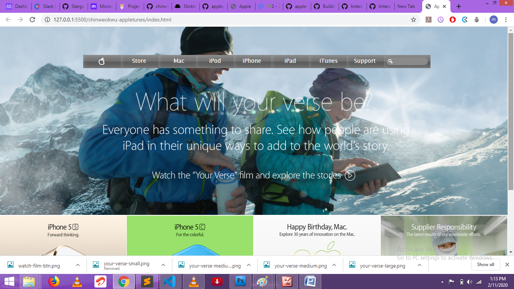

# chinweokwu-appletunes

>PROJECT: BUILDING WITH BACKGROUNDS AND GRADIENTS
> This project consists of building an HTML document that matches the appearance of [apple.com’s](https://www.apple.com) appletunes page

## Built With

- HTML, CSS,
- Flexbox
- grid
- 
## Live Demo

[Live Demo Link](https://vigilant-varahamihira-15cf40.netlify.com/)

## Getting Started

To get a local copy up and running follow these simple example steps.

### Prerequisites

To make this repository working in your local machine you need only a browser.

## Authors

👤 **Paul Chinweokwu Morah**

- Github: [@githubhandle](https://github.com/chinweokwu)
- Twitter: [@twitterhandle](https://twitter.com/Morah89820846)
- Linkedin: [linkedin](https://www.linkedin.com/in/paul-morah-285b63172/)

## 🤝 Contributing

Contributions, issues and feature requests are welcome!

Feel free to check the [issues page](https://github.com/chinweokwu/chinweokwu-appletunes/issues).

## Show your support

Give a ⭐️ if you like this project!

## Acknowledgments

a big hat to me and  anyone who help me either by openning issues on this repository or reviewing our code :)

## 📝 License

This project is [MIT](lic.url) licensed.
